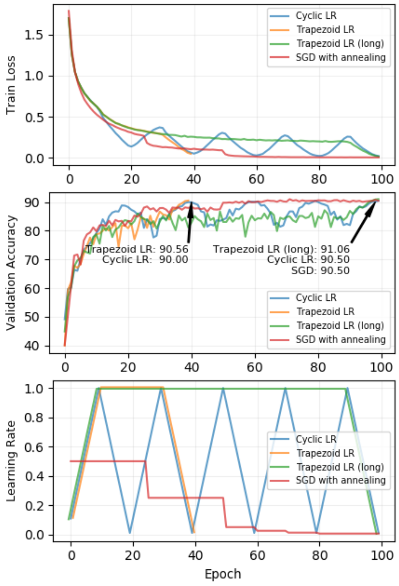
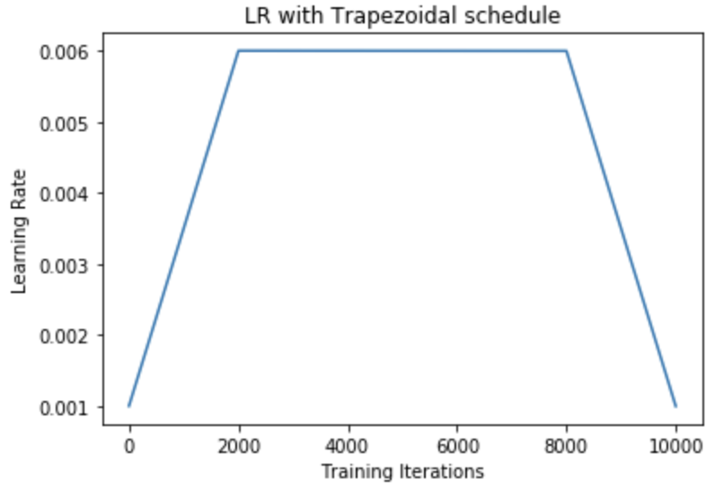
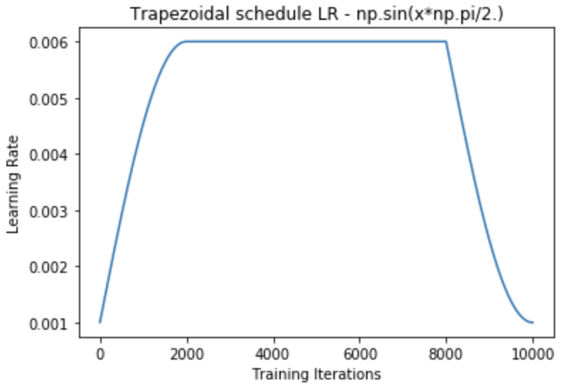
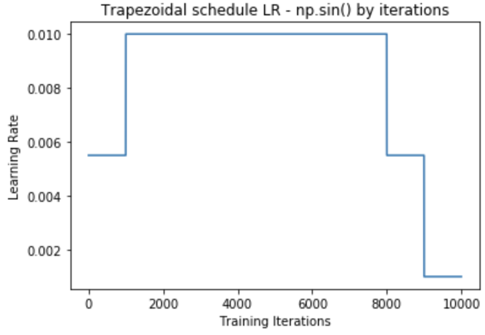

# Trapezoid Learning Rate schedule


Thanks to [bckenstler/CLR](https://github.com/bckenstler/CLR), a Keras callback implementation of cyclical learning rate policies, this is basically a fork repository from it to implement trapezoid schedule of learning rate.

This repository implements of trapezoid schedule of learning rate, as detailed in this paper [Chen Xing, Devansh Arpit, Christos Tsirigotis, Yoshua Bengio,
      A Walk with SGD, arXiv:1802.08770](https://arxiv.org/abs/1802.08770).

A Trapezoid schedule of Learning Rate or TLR is a policy of learning rate adjustment that increases the learning rate as training progresses,
then keep it until final part of training. Then it decreases learning rate
to make loss annealed and converged to a minimum.

This paper refers to [Leslie N. Smith, Cyclical Learning Rates for Training Neural Networks, arXiv:1506.01186v4](https://arxiv.org/abs/1506.01186),
we could say that trapezoid schedule is a single cycle version of cyclic learning rate.

## CLR or TLR



This is figure 6 from the paper.
The author says that _"In our experiments, we find that methods which increase learning rate during training may be considered slightly better."_

2nd figure shows that TLR finally achieved the best performance.

But as the author also says that _"We leave an extensive study of learning rate schedule design based on the proposed guideline as future work,"_ TLR would be the better for now and will hopefully be replaced by refined design.

## TrapezoidalLR()

This is Keras callback implementation, designed to enable easy experimentation as the original CLR implementation was.

(It is designed to be used with any optimizer in Keras, though not tested so much so far.)

`tlr_callback.py` contains the callback class `TrapezoidalLR()`.

Arguments for this class include:

* `base_lr`: initial learning rate which is the lower boundary. This overrides optimizer `lr`. Default 0.001.
* `max_lr`: upper boundary for lr calculation. The lr at any iteration is in between this `max_lr` and `base_lr`. Default 0.006.
* `step_size`: number of training iterations per ramp up or down of trapezoid. CLR paper's authors suggest setting `step_size = (2-8) x (training iterations in epoch)`. Default 2000.
* `anneal_start_epoch`: number of epoch to start annealing at final stage of training. Default is `10 - 1 = 9`, but this basically needs to be set specifically for your training.
* `scale_fn`: custom scaling curve defined by a single argument lambda function, where `0 <= scale_fn(x) <= 1` for all `x >= 0`. Default `None`.
* `scale_mode`: `{'zero2one', 'iterations'}`. Defines whether `scale_fn` is evaluated on $[0, iteration/step\_size]$ or training iterations since start of ramp up or down. Default is `'zero2one'`.

**NOTE: This callback overrides `optimizer.lr`**

The general structure of schedule algorithm is:

```python
iteration = min(iteration, self.step_size)
x = np.abs(iteration/self.step_size)
if self.scale_mode == 'zero2one':
    x = self.scale_fn(x)
else:
    x = self.scale_fn(iteration)
if (ramping down i.e. annealing):
    x = 1 - x
return (1 - x) * self.base_lr + x * self.max_lr
```

where `iteration` is number of iteration since start of ramp up or down, or it will be equal to `step_size` in between.

Calculated lr starts from `base_lr` to `max_lr` as iteration increases, then keeps the maximum lr until it reaches to `anneal_start_epoch`. After `anneal_start_epoch`, it decreases from `max_lr` to `base_lr`. This is basic default behavior.

## Determining `anneal_start_epoch`

`anneal_start_epoch` needs to be set according to your training epoch.
Learning rate start decreasing at this epoch, then recommended to set it as "`the total epochs - some epochs`".


# Custom scaling curve

When you need custom the ramp up/ down curve, set `scale_fn` and `scale_mode`. Exact calculations is:

$$
lr = \begin{cases}
    scale\_fn(\frac{iteration}{step\_size})  \;\;\; ( scale\_mode = `zero2one` ) \\
    \\
    scale\_fn(iteration) \;\;\;\; ( scale\_mode = `iterations` )
 \end{cases}
$$

## By default


By default it is simple linear curve.

Example:

```python
    tlr = CyclicLR(base_lr=0.001, max_lr=0.006,
                step_size=2000, anneal_start_epoch=my_epochs - 2)
    model.fit(X_train, Y_train, callbacks=[tlr])
``` 

Results:



## Custom scaling <sub><sup>(`scale_mode` = `'zero2one'`)</sup></sub>

$iteration / step\_size$ is fed to `scale_fn`, then lr is calculated as:

$$
lr = scale\_fn(\frac{iteration}{step\_size})
$$

Example:

```python
    epochs = 10
    tlr_fn = lambda x: np.sin(x*np.pi/2.)
    tlr = TrapezoidalLR(base_lr=0.001, max_lr=0.006,
                        step_size=2000, anneal_start_epoch=epochs - 2,
                        scale_fn=tlr_fn, scale_mode='zero2one')
    model.fit(X, Y, batch_size=2000, epochs=epochs, callbacks=[tlr])
```

Results:



## Custom Iteration <sub><sup>(`scale_mode` = `'iterations'`)</sup></sub>

Just $iteration$ is fed to `scale_fn`, then lr is calculated as:

$$
scale\_fn(iteration)
$$

Example:

```python
epochs = 10
step_size = 2000
tlr_fn = lambda i: 0.5 if i < step_size/2 else 1.0
tlr = TrapezoidalLR(base_lr=0.001, max_lr=0.01,
                    step_size=step_size, anneal_start_epoch=epochs - 2,
                    scale_fn=tlr_fn, scale_mode='iterations')
model.fit(X, Y, batch_size=step_size, epochs=epochs, callbacks=[tlr])
```

Results:




# Additional Information

## Changing/resetting

During training, you may wish to adjust your schedule parameters: 

```python
tlr._reset(new_base_lr,
           new_max_lr,
           new_step_size,
           new_anneal_start_epoch)
```

Calling `_reset()` allows you to start a new schedule w/ new parameters. 

`_reset()` also sets the iteration count to zero. If you are using a custom amplitude scaling, this ensures the scaling function is reset.

If an argument is not included in the function call, then the corresponding parameter is unchanged in the new cycle. As a consequence, calling `tlr._reset()` simply resets the original schedule.

## History

`TrapezoidalLR()` keeps track of learning rates, loss, metrics and more in the `history` attribute dict. This generated plots above.

## Choosing a suitable base_lr/max_lr (LR Range Test) from CLR paper


The CLR author offers a simple approach to determining the boundaries of your cycle by increasing the learning rate over a number of epochs and observing the results. They refer to this as an "LR range test."

An LR range test can be done using the `triangular` policy; simply set `base_lr` and `max_lr` to define the entire range you wish to test over, and set `step_size` to be the total number of iterations in the number of epochs you wish to test on. This linearly increases the learning rate at each iteration over the range desired.

The author suggests choosing `base_lr` and `max_lr` by plotting accuracy vs. learning rate. Choose `base_lr` to be the learning rate where accuracy starts to increase, and choose `max_lr` to be the learning rate where accuracy starts to slow, oscillate, or fall (the elbow). In the example above, Smith chose 0.001 and 0.006 as `base_lr` and `max_lr` respectively.

### Plotting Accuracy vs. Learning Rate

In order to plot accuracy vs learning rate, you can use the `.history` attribute to get the learning rates and accuracy at each iteration.

```python
model.fit(X, Y, callbacks=[tlr])
h = tlr.history
lr = h['lr']
acc = h['acc']
```

## Order of learning rate augmentation

Note that the TLR callback updates the learning rate prior to any further learning rate adjustments as called for in a given optimizer.

## Functionality Test

tlr_callback_tests.ipynb contains tests demonstrating desired behavior of optimizers.
